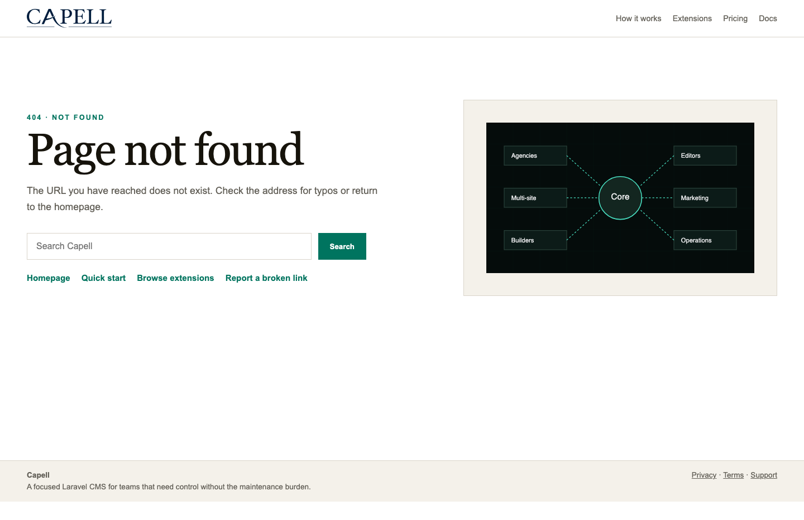
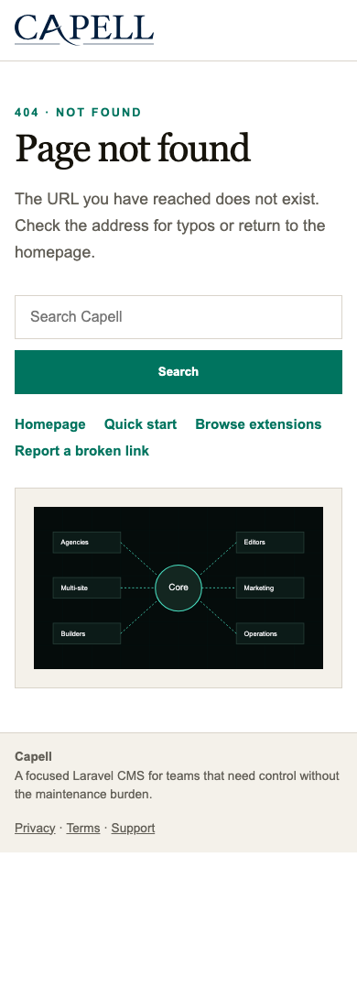

# Smart 404

<!-- prettier-ignore-start -->

## What This Plugin Adds

Smart 404 is an **Available**, **No schema impact** Capell package in the **Capell Search & SEO** product group. It ships as `capell-app/smart-404` and extends these surfaces: admin, frontend, console.

Smart 404 turns missing-page dead ends into a short list of deterministic, site-scoped public URL suggestions.

Frontend and static 404 documents keep their 404 status while similar links and nearby hierarchy are available with or without JavaScript.

Evidence: [`src/Actions/ResolveSmart404SuggestionsAction.php`](src/Actions/ResolveSmart404SuggestionsAction.php), [`resources/views/widget.blade.php`](resources/views/widget.blade.php), [`routes/web.php`](routes/web.php), [`resources/dist/smart-404.js`](resources/dist/smart-404.js), [`src/Support/RenderHooks/RegisterSmart404Hook.php`](src/Support/RenderHooks/RegisterSmart404Hook.php), [`tests/Unit/Actions/ResolveSmart404SuggestionsActionTest.php`](tests/Unit/Actions/ResolveSmart404SuggestionsActionTest.php).

Status details:

- Status: Available
- Tier: premium
- Bundle: search-seo
- Composer package: `capell-app/smart-404`
- Namespace: `Capell\Smart404`
- Theme key: not applicable

## Why It Matters

**For developers:** The resolver uses the shared registry, a fixed similarity threshold, safe relative URLs, and a bounded public endpoint rather than application-specific queries in Blade.

**For teams:** Visitors get useful next steps without redirects, visitor tracking, AI services, or exposing unpublished content.

Evidence: [`src/Actions/ResolveSmart404SuggestionsAction.php`](src/Actions/ResolveSmart404SuggestionsAction.php), [`src/Http/Controllers/Smart404SuggestionsController.php`](src/Http/Controllers/Smart404SuggestionsController.php), [`config/capell-smart-404.php`](config/capell-smart-404.php), [`resources/views/widget.blade.php`](resources/views/widget.blade.php), [`src/Health/Smart404HealthCheck.php`](src/Health/Smart404HealthCheck.php).

## Screens And Workflow

Screenshot contract: `docs/screenshots.json`.

- Smart 404 suggestions on a missing public page (desktop) (frontend, required evidence).
- Smart 404 suggestions on a missing public page (mobile) (frontend, required evidence).
- Smart 404 settings (admin, required evidence).

## Technical Shape

### Service providers

- `Capell\Smart404\Providers\Smart404ServiceProvider`
- `Capell\Smart404\Providers\AdminServiceProvider`

### Config files

- `packages/smart-404/config/capell-smart-404.php`

### Settings migrations

- `packages/smart-404/database/settings/2026_08_08_000001_create_smart_404_settings.php`

### Settings classes

- `Smart404Settings`

### Filament classes

- `Smart404SettingsSchema`

### Route files

- `packages/smart-404/routes/web.php`

### Actions

- `InstallSmart404PackageAction`
- `ResolveSmart404SuggestionsAction`

### Data objects

- `Smart404PublicUrlEntryData`
- `Smart404SuggestionData`

### Manifest action API

- `install: Capell\Smart404\Actions\InstallSmart404PackageAction`
- `resolveSuggestions: Capell\Smart404\Actions\ResolveSmart404SuggestionsAction`

### Manifest contributions

- `frontend-component: Capell\Smart404\Manifest\Smart404WidgetContribution`
- `health-check: Capell\Smart404\Manifest\Smart404HealthContribution`
- `route: Capell\Smart404\Manifest\Smart404FrontendRoutesContribution`
- `setting: Capell\Smart404\Manifest\Smart404SettingsContribution`

### Health checks

- `Capell\Smart404\Health\Smart404HealthCheck`

### Blade views

- `packages/smart-404/resources/views/widget.blade.php`

### Cache tags

- `smart-404`

## Data Model

- Required tables: `settings`, `pages`, `sites`.
- Migration impact: run host migrations through the package install flow before opening package surfaces.
- Deletion/retention behaviour: Docs gap: migrations and manifest contributions do not prove a cascade, pruning command, or timed retention policy.

## Install Impact

- Required packages: `capell-app/admin`, `capell-app/core`, `capell-app/discovery-foundation`, `capell-app/frontend`.
- Admin navigation: no admin page or resource contribution is declared.
- Admin/editor extensions: none declared.
- Permissions: no package permission declarations or Shield gates detected; host access rules still apply.
- Public routes: loads `routes/web.php`; registers `Smart404FrontendRoutesContribution`.
- Database changes: no package migrations declared.
- Config: `config/capell-smart-404.php`.
- Settings: `Capell\Smart404\Settings\Smart404Settings`.
- Queues or schedules: none declared.
- Cache tags: `smart-404`.
- Commands: none declared.

## Common Pitfalls

- Keep required Capell packages on compatible v4 releases: `capell-app/admin`, `capell-app/core`, `capell-app/discovery-foundation`, `capell-app/frontend`.
- Review package configuration before production-like verification: `config/capell-smart-404.php`, `Capell\Smart404\Settings\Smart404Settings`.
- Review middleware, throttling, signatures, and public-output safety in `routes/web.php` before exposing routes.
- Keep public Blade and cached HTML free of authoring markers, model IDs, permissions, signed editor URLs, and lazy database queries.
- Custom write integrations must preserve invalidation for `smart-404` cache tags.

## Troubleshooting

| Symptom | Likely cause | Check | Fix |
| --- | --- | --- | --- |
| Package surface is missing after install | Provider or manifest is not loaded | Confirm `capell.json`, package `composer.json`, and provider registration | Reinstall the package, refresh Composer autoload, and clear host caches |
| Route returns unexpected output | Route cache, middleware, or signed URL setup does not match the package route file | Check the route files listed in `Technical Shape` | Clear route cache and verify middleware before exposing public routes |
| Public output leaks unexpected state | Render data, cache variation, or authoring boundary has regressed | Check public Blade, cache tags, and public-output safety tests | Move data loading out of Blade and rerun the package public-output tests |

## Quick Start

1. Install the package: `composer require capell-app/smart-404`.
2. Open the package admin surface at `/extensions` and confirm Smart 404 is available.

## Next Steps

- [Package docs](docs/README.md)
- [Overview](docs/overview.md)
- Configuration files: [`config/capell-smart-404.php`](config/capell-smart-404.php).
- [Troubleshooting](#troubleshooting)
- [Screenshot contract](docs/screenshots.json)
- [Capell content language plan](../../docs/CONTENT_LANGUAGE_PLAN.md)
- [Capell documentation design system](../../docs/DESIGN_SYSTEM.md)
- [Capell and package ERD notes](../../docs/erd/capell-and-package-erds.md)
- Related packages: [Discovery Foundation](../discovery-foundation/README.md), [Site Discovery](../site-discovery/README.md).
- Focused tests: `vendor/bin/pest packages/smart-404/tests --configuration=phpunit.xml`.

<!-- prettier-ignore-end -->
